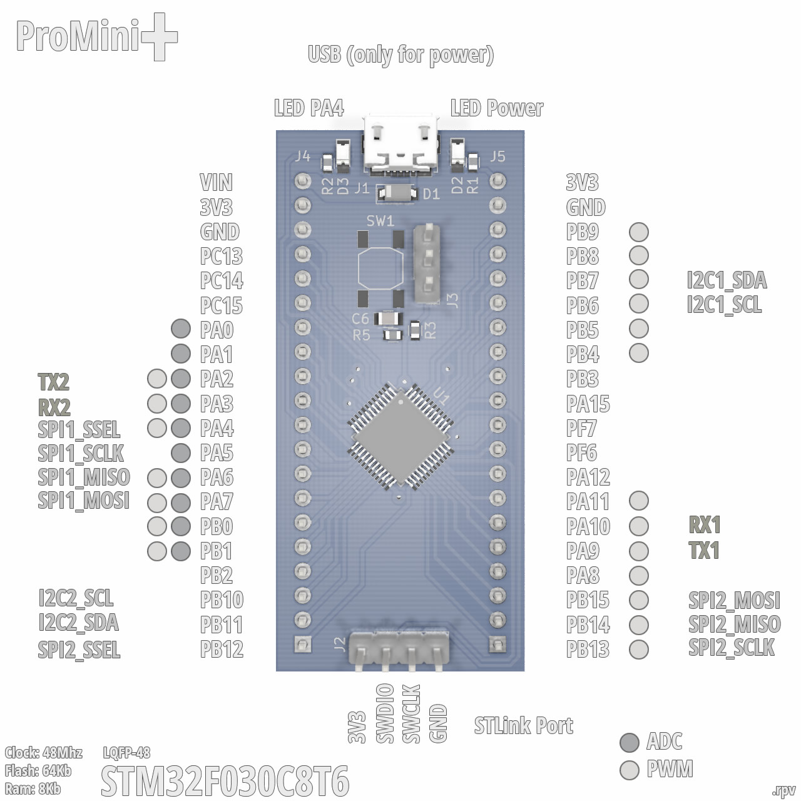

# rSTM32F030C8T6 ProMini+
An ST development board based on the STM32F030C8T6 (Clock: 48MHz, Flash: 64Kb, Ram:8Kb) MCU compatible with STM32Duino (Arduino). 


Pinout:




## Files and Folders description

- **RBOARD_F030C8T6** it's the variant board for the STM32 Arduino Core.
- **rSTM32F030C8T6** it's the KiCAD 5.1.2 project.
- **rSTM32F030C8T6.schematic.pdf** the schematic.


## Install

**Update:** STCore v2.0 includes support for this MCU, if you're using STCore v2.0 you don't need to install anything.

- This requires the [STM32 core for arduino](https://github.com/stm32duino/Arduino_Core_STM32/), the ST original.
- I used this [guide to add the board](https://github.com/stm32duino/wiki/wiki/Add-a-new-variant-(board)), you can check it or continue with my suggestions to install the new board.
- Copy the **"RBOARD_F030C8T6"** folder to the Arduino **"variants"** folder, in win7 is located at: **c:\Users\\<USERNAME\>\AppData\Local\Arduino15\packages\STM32\hardware\stm32\1.6.1\variants**
- Edit the **"boards.txt"** file, in win7 is located at a lever up than the "variants" folder, search for the **F030F4** board and add the lines to leave it as I show you next:

```
# DEMO_F030F4 board
# Support: Serial1 (USART1 on PA3, PA2)
GenF0.menu.pnum.DEMO_F030F4=STM32F030F4 Demo board
GenF0.menu.pnum.DEMO_F030F4.upload.maximum_data_size=4096
GenF0.menu.pnum.DEMO_F030F4.upload.maximum_size=16384
GenF0.menu.pnum.DEMO_F030F4.build.mcu=cortex-m0
GenF0.menu.pnum.DEMO_F030F4.build.board=DEMO_F030F4
GenF0.menu.pnum.DEMO_F030F4.build.series=STM32F0xx
GenF0.menu.pnum.DEMO_F030F4.build.product_line=STM32F030x6
GenF0.menu.pnum.DEMO_F030F4.build.variant=DEMO_F030F4
GenF0.menu.pnum.DEMO_F030F4.build.cmsis_lib_gcc=arm_cortexM0l_math

# RBOARD_F030C8T6 board
# Support: Serial1 (USART1 on PA3, PA2)
GenF0.menu.pnum.RBOARD_F030C8T6=STM32F030C8 STProMiniPlus
GenF0.menu.pnum.RBOARD_F030C8T6.upload.maximum_data_size=8192
GenF0.menu.pnum.RBOARD_F030C8T6.upload.maximum_size=65536
GenF0.menu.pnum.RBOARD_F030C8T6.build.mcu=cortex-m0
GenF0.menu.pnum.RBOARD_F030C8T6.build.board=RBOARD_F030C8T6
GenF0.menu.pnum.RBOARD_F030C8T6.build.series=STM32F0xx
GenF0.menu.pnum.RBOARD_F030C8T6.build.product_line=STM32F030x8
GenF0.menu.pnum.RBOARD_F030C8T6.build.variant=RBOARD_F030C8T6
GenF0.menu.pnum.RBOARD_F030C8T6.build.cmsis_lib_gcc=arm_cortexM0l_math
```


## The real board


## Running some tests


The **ProMini+** running the Adafruit ILI9341 library over hardware SPI.


_Video in progress..._
